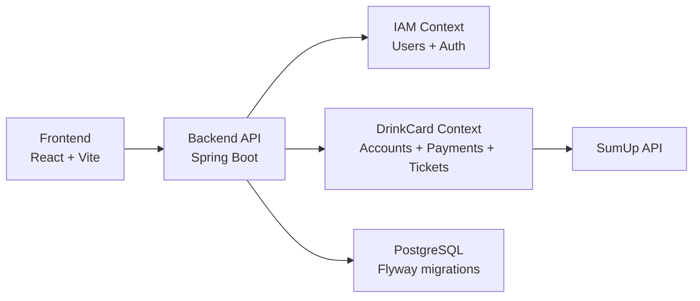
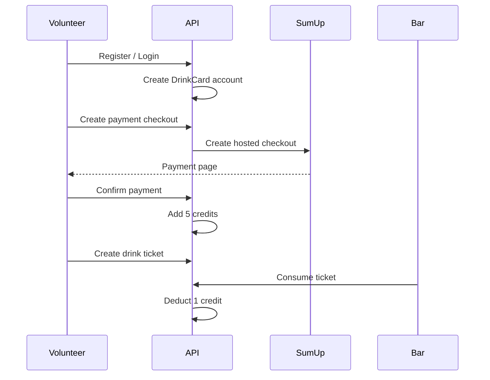

# DrinkCard MOA


DrinkCard MOA is a festival drink-card platform that replaces paper drink vouchers with digital credits, online payments, and one-use QR drink tickets.

The goal of the project is to make drink consumption easier to manage during a festival: volunteers can buy and spend credits from their phone, bar staff can validate drinks through QR codes, and organizers can monitor users, balances, payments, and activity from an admin area.

This repository contains the **Spring Boot backend API**. The wider product also includes a React, TypeScript, and Vite frontend.

## Contents

- [Product Scope](#product-scope)
- [Current Status](#current-status)
- [Architecture](#architecture)
- [Core Flows](#core-flows)
- [Getting Started](#getting-started)
- [API Overview](#api-overview)
- [Roadmap](#roadmap)

## Product Scope

DrinkCard MOA is designed around three operational views of the same festival system. Each view has a different responsibility, but all of them work over the same source of truth: the volunteer account, its available credits, the generated drink tickets, and the payment history.

| Experience | Purpose |
| --- | --- |
| Volunteer | Register, log in, check balance, buy credits, and generate QR tickets. |
| Bar staff | Scan QR tickets and approve drink consumption. |
| Organizer | Review users, accounts, payments, tickets, and operational metrics. |

Full functional documentation: [documentacion-funcional-app-festival.en.md](documents/documentacion-funcional-app-festival.en.md)

## Current Status

The backend already covers the main drink-card lifecycle: user registration, automatic account creation, payment checkout, credit balance updates, QR ticket generation, ticket expiration, and ticket consumption.

Some frontend/admin features are intentionally still marked as future work. The README separates implemented backend behavior from planned product functionality to avoid presenting static or planned screens as completed backend features.

| Area | Status |
| --- | --- |
| JWT authentication | Implemented |
| Volunteer registration/login | Implemented |
| DrinkCard account creation | Implemented |
| SumUp checkout flow | Implemented |
| Drink ticket backend flow | Implemented |
| Admin user/account/payment/ticket listings | Implemented |
| Real analytics | Planned |
| Shift management | Planned |
| Strict `BAR_STAFF` role enforcement | Planned |
| Credit transaction ledger | Planned |

## Architecture

The project follows a layered/hexagonal style. Domain rules live in the domain layer, use cases in the application layer, and technical concerns such as REST controllers, persistence, security, events, scheduling, and payment integration live in infrastructure adapters.



<details>
<summary>Project structure</summary>

```text
src/main/java/.../drinkcardmoa
|-- iam
|   |-- domain
|   |-- application
|   `-- infrastructure
|-- drinkcard
|   |-- domain
|   |-- application
|   `-- infrastructure
`-- shared
    |-- domain
    |-- application
    `-- infrastructure

src/main/resources
`-- db/migration
```

</details>

<details>
<summary>Main business rules</summary>

- New users register as `VOLUNTEER`.
- Registration publishes `UserRegisteredEvent`.
- The DrinkCard module creates an account for the new volunteer.
- A card purchase adds 5 credits and costs 10 EUR.
- Each drink ticket costs 1 credit.
- Only one pending ticket is allowed per volunteer.
- Tickets expire after 90 seconds.
- QR payloads contain only the ticket ID.
- Admin endpoints require role `ADMIN`.

</details>

## Core Flows

The most important behavior in the system is event-driven around the volunteer lifecycle. Registration creates the identity, the DrinkCard module creates the account, payments add credits, and ticket consumption removes credits only after a valid QR ticket is scanned.



## Getting Started

### Requirements

- Java 21
- Maven 3.9+
- Docker and Docker Compose

### Run locally

```bash
cp .env.example .env
docker compose up -d
mvn spring-boot:run
```

API base URL:

```text
http://localhost:8080
```

Run tests:

```bash
mvn test
```

## API Overview

All protected endpoints require:

```text
Authorization: Bearer <jwt>
```

<details>
<summary>Public endpoints</summary>

| Method | Endpoint | Description |
| --- | --- | --- |
| `POST` | `/api/v1/auth/register` | Register a volunteer. |
| `POST` | `/api/v1/auth/login` | Log in and receive a JWT. |

</details>

<details>
<summary>Volunteer endpoints</summary>

| Method | Endpoint | Description |
| --- | --- | --- |
| `GET` | `/api/v1/users/me` | Current user profile. |
| `GET` | `/api/v1/drink-card-accounts/me` | Current DrinkCard account. |
| `POST` | `/api/v1/payments/checkout` | Create SumUp checkout. |
| `POST` | `/api/v1/payments/{paymentId}/confirm` | Confirm payment. |
| `GET` | `/api/v1/payments/me` | List current volunteer payments. |
| `POST` | `/api/v1/drink-tickets` | Create drink ticket. |
| `POST` | `/api/v1/drink-tickets/{ticketId}/consume` | Consume ticket. |
| `GET` | `/api/v1/drink-tickets/{ticketId}/status` | Ticket status. |
| `GET` | `/api/v1/drink-tickets/me` | List current volunteer tickets. |

</details>

<details>
<summary>Admin endpoints</summary>

| Method | Endpoint | Description |
| --- | --- | --- |
| `GET` | `/api/v1/admin/users` | List users. |
| `GET` | `/api/v1/admin/users/{userId}` | Get user details. |
| `GET` | `/api/v1/admin/drink-card-accounts` | List DrinkCard accounts. |
| `GET` | `/api/v1/admin/drink-card-accounts/{volunteerId}` | Get account by volunteer ID. |
| `POST` | `/api/v1/admin/drink-card-accounts/{volunteerId}/disable-refill` | Disable refill for an account. Existing tickets remain usable. |
| `POST` | `/api/v1/admin/drink-card-accounts/{volunteerId}/enable-refill` | Re-enable refill for an account. |
| `GET` | `/api/v1/admin/payments` | List payments. |
| `GET` | `/api/v1/admin/drink-tickets` | List drink tickets. |

</details>

## Roadmap

The next backend steps focus on turning the current festival workflow into a more complete operational platform:

- Add explicit `BAR_STAFF` role and protect ticket consumption.
- Add shift management backend.
- Add analytics endpoints for drink mix, revenue, and hourly consumption.
- Add credit transaction ledger.
- Add admin actions to suspend/reactivate users and accounts.
- Add volunteer payment and ticket history screens.

## License

License information has not been added yet.
